# Dockerizar Flask

Partiendo de la guía adjunta adjunta y realizando la gestión de dependencias del proyecto en el Dockerfile, tal y como habéis anteriormente, se trata de crear una imagen personalizada con Flask y Mongo Atlas en Docker. Tened en cuenta que tenéis una nota, creada por David, de Slack con los recursos necesarios para realizar la actividad.

Deberéis realizar todo el proceso de investigación, implementación y documentación.

La entrega será mediante un repositorio adjunto a esta tarea en la que, tal y como hemos hecho otras veces, podamos revisar el resultado.

Opcionalmente podéis subir la imagen a docker hub. Finalmente, y también de manera opcional, podéis publicar la API REST siguiendo la filosofía en la parte B de la tarea anterior de NGINX.

## Dockerizar el proyecto

Hacer el `Dockerfile`.

En este tipo de documento se pone toda la información que sabemos que no tiene errores en la cual encontramos:
- `FROM` lenguaje utilizado en la api
- `EXPOSE` Puertos que usa la api
- `WORKDIR`Crea la carpeta del nombre que le digas

¿Qué puede ocasionar problemas y es importante poner?
- `RUN apt update` comando para actualizar el sistema apt.El gestor de paquetes compruba el paquete y si hay nuevas actualizaciones.
- `RUN apt upgrade -y` en el caso que haya actualizaciones o modificaciones lo ejecuta y lo actualiza
- `COPY . /app` copia la aplicación 
- `RUN pip install -r requirements.txt` inicializa el archivo _requirements.txt_ que contiene todas las dependencias 
- `ENTRYPOINT flask run --host=0.0.0.0 --port=5000` inicializa la aplicación y asi poder ver al funcionamiento. 

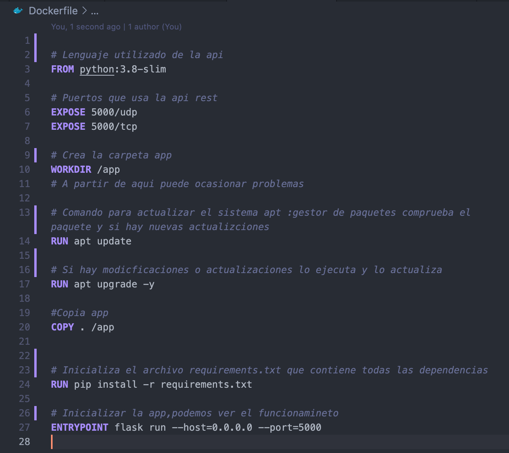

## Crear una imagen personalizada con flask y subirla a dockerhub. 

1. crear imagen de docker
```
docker build -t webserver .
```
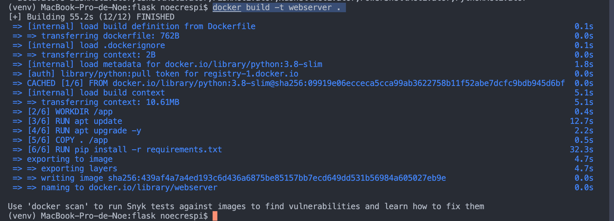


*¿como subir una imagen la plataforma?* 

1. Subir la imagen al [dockerhub](https://hub.docker.com/), para ello tendremos que iniciar sesión o crearnos una cuenta. 

2. usar en consola y crea una etiqueta TargetImagen que haga referencia al SourceImagen
```
docker tag nombreImagen nombreUsuario/nombreImagen
```

3. subir la imagen a dockerhub, usar el comando .
```
docker push nombreUsuario/nombreImagen
```
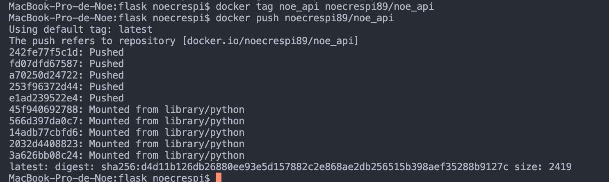

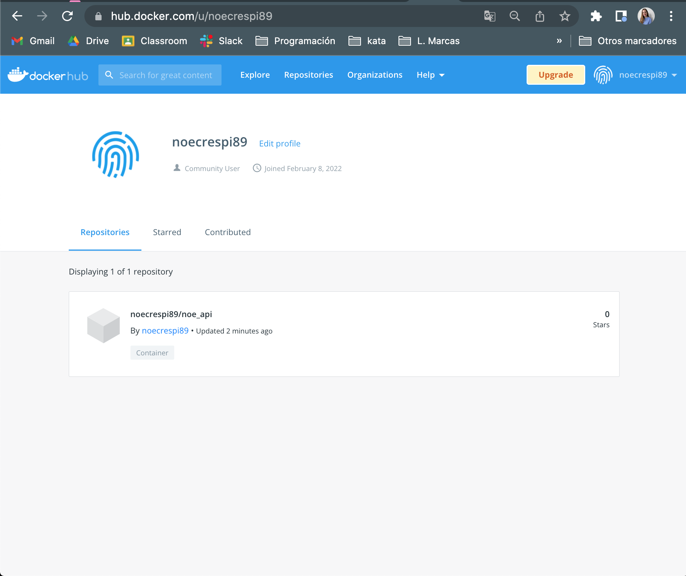

## Conactarla a una máquina virtual.

Crear la máquina virtual los pasos a seguir lo podemos encontrar [aquí](https://docs.google.com/document/d/13vzsd1948ccYS50FjtDKF9dn6-qeVR1Cd3_X9rAe_Zk/edit?usp=sharing). 

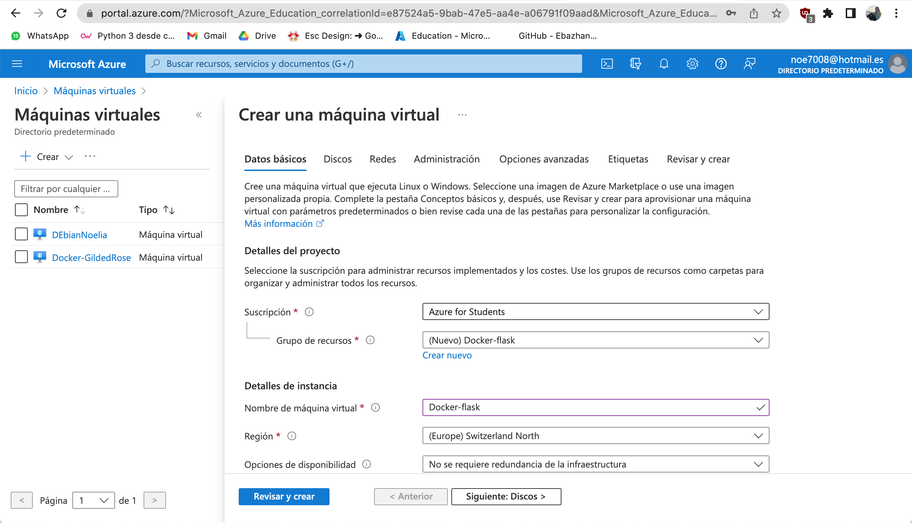
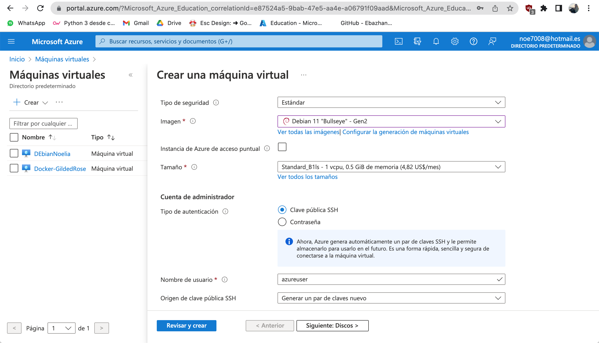
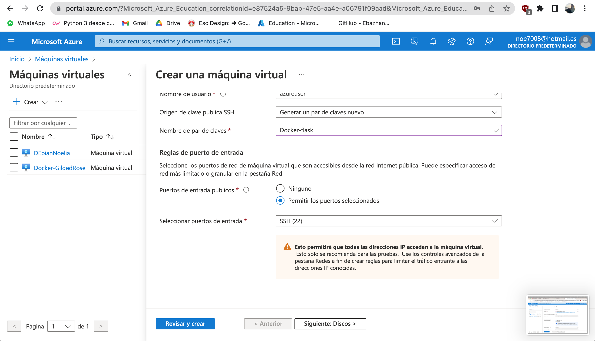

#### Conectar a la máquina virtual. 

1. Copiar la IP pública de nuestra máquina para poder conectarnos a través de SSH.
2. Acceder a conectar (clicar SSH).
3. Instalar PuTTY. 
4. Conectarse a la máquina con nuestro usuario y contraseña.

```
sudo ssh -i Docker-flask.pem nombreUsuario@direcciónIPPublica
```
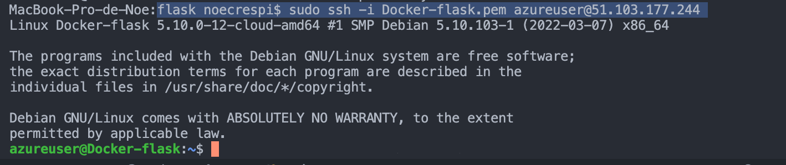
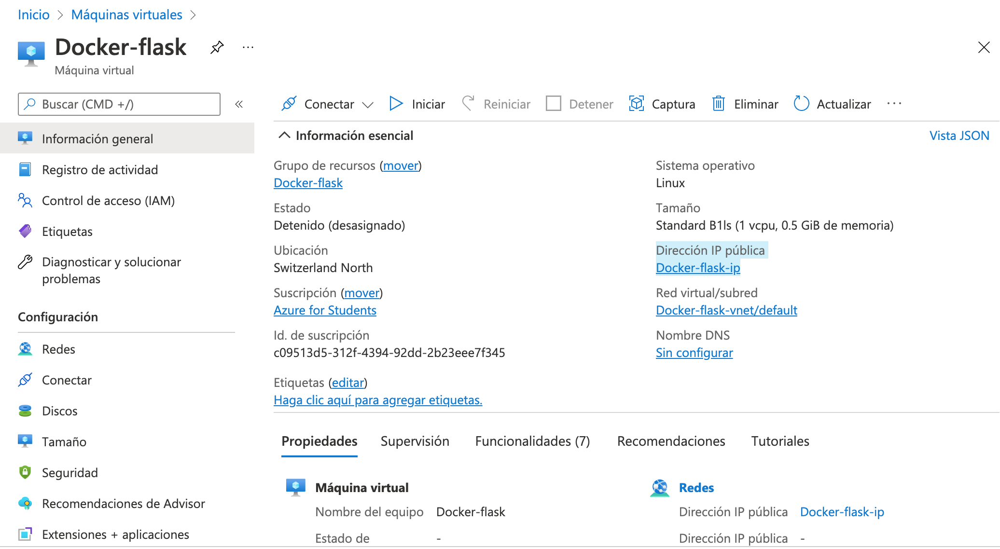

*Instalar la paquetería necesaria en la máquina virtual*

```
sudo apt update
```

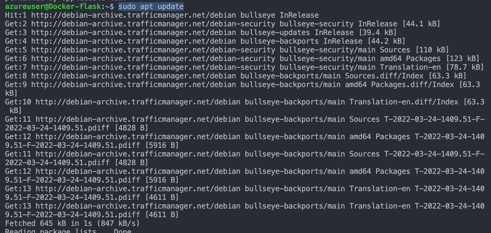

```
sudo apt upgrade
```

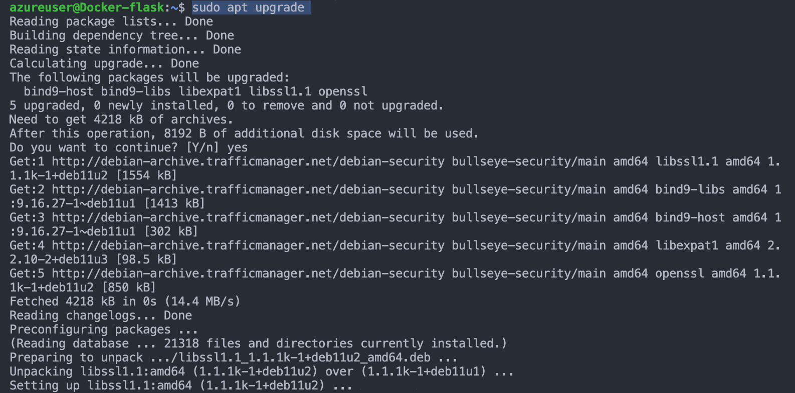

*Istalar git*
```
sudo apt-get install git
```
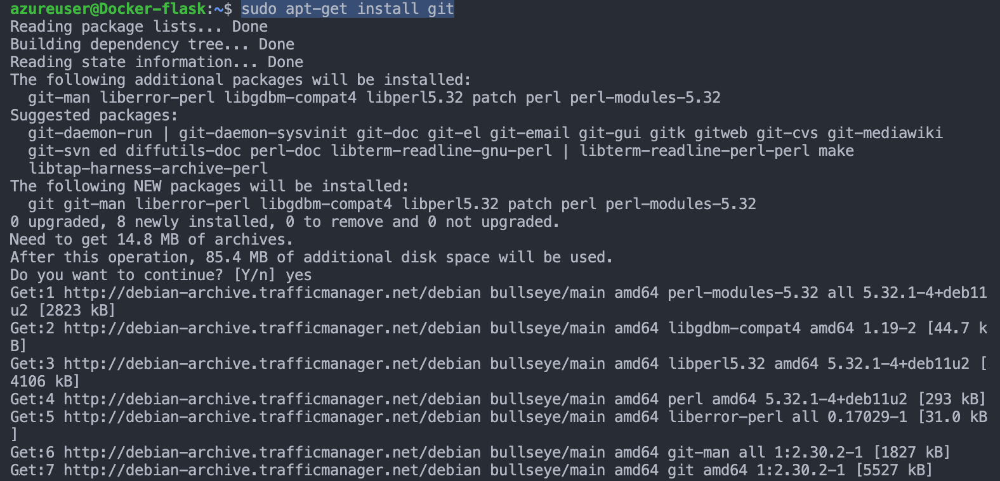

*Instalar Docker (nivel ninja utilizando el script de bash obtenido de get-docker.com)*

```
sudo apt-get install docker.io
```
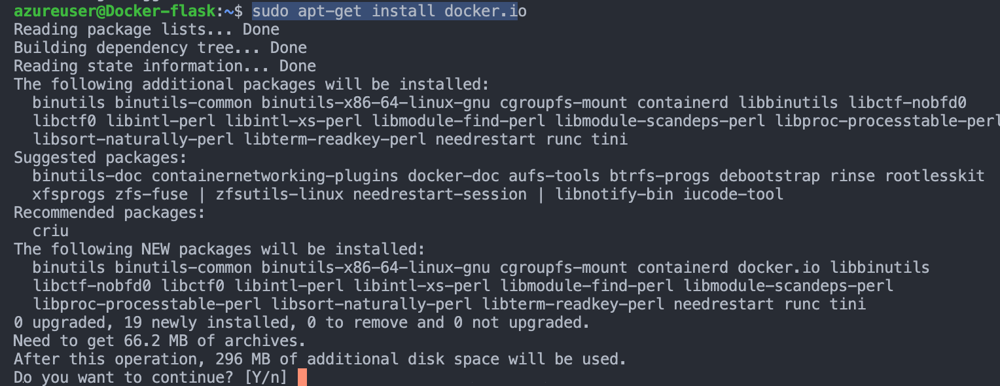

*Dockerizar la api*
```
git clone https://github.com/noecrespi/Api_Docker.git
```


```
sudo docker build -t docker-flask . 
```
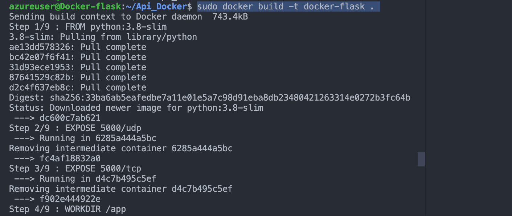

Arrancar el docker (
80:5000 (puerto) + nombreImagen).
```
docker run -dp 80:5000 docker-flask
```
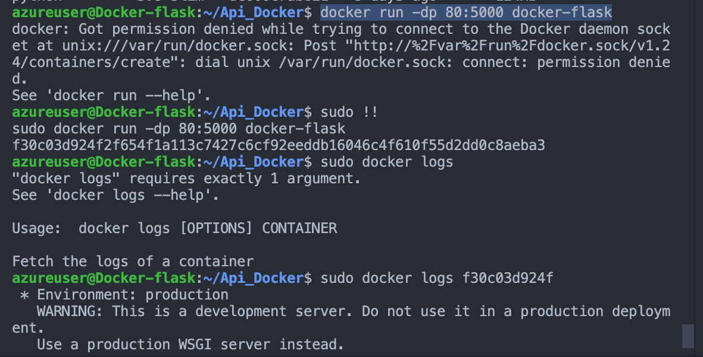
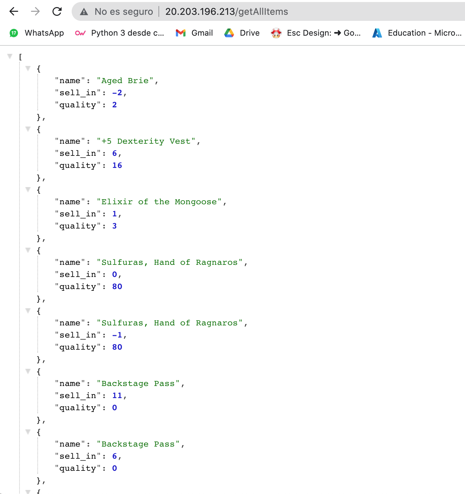